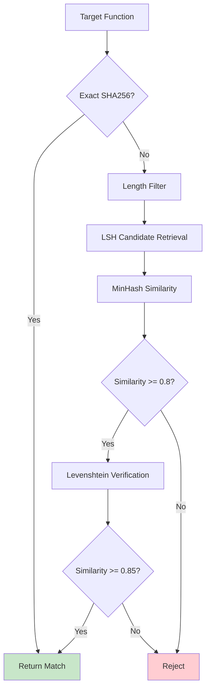

## Overview

The Analyzer (`pkg/analyzer/`) implements a two-stage fuzzy matching system that identifies vulnerable npm packages even when obfuscated or modified. It combines **MinHash** for approximate set similarity with **Levenshtein distance** for string similarity, achieving high precision without exact hash matches.

## Why Fuzzy Matching?

### Obfuscation Challenges

Exact hash matching fails when packages are obfuscated:

<Tabs>
  <Tab title="Original Code">
    ```javascript
    export function validateUser(username, password) {
        const API_ENDPOINT = 'https://api.example.com/auth';
        return fetch(API_ENDPOINT, {
            method: 'POST',
            body: JSON.stringify({ username, password })
        });
    }
    ```
    
    **SHA256 of Structural IR:** `a3f5c8d9...`
  </Tab>
  
  <Tab title="Minified">
    ```javascript
    export function a(b,c){const d='https://api.example.com/auth';return fetch(d,{method:'POST',body:JSON.stringify({username:b,password:c})})}
    ```
    
    **SHA256 of Structural IR:** `a3f5c8d9...` ✅ (opcodes unchanged)
    
    **SHA256 of Content IR2:** `7e2b1a4f...` ❌ (identifiers changed)
  </Tab>
  
  <Tab title="String Encrypted">
    ```javascript
    export function validateUser(username, password) {
        const API_ENDPOINT = decrypt('xK9mP2qL...');
        return fetch(API_ENDPOINT, {
            method: decrypt('pR4tS8nM...'),
            body: JSON.stringify({ username, password })
        });
    }
    ```
    
    **SHA256 of Content IR1:** `9d4e6c2a...` ❌ (strings encrypted)
    
    **SHA256 of Structural IR:** `b7f3e1c9...` ❌ (new `decrypt` calls)
  </Tab>
</Tabs>

**Fuzzy matching solves this:**

Even if 40% of the function is modified, the remaining 60% similarity can still identify the package.

## Fingerprint Generation

### Three-Level IR System

Each function is represented by three complementary intermediate representations:

```go pkg/hbc/types/functionobject.go:144
func (fo *FunctionObject) ToIR() (structuralIR, contentIR1, contentIR2 string) {
    // Structural IR: Opcode sequence with parameter count
    structuralIR = fmt.Sprintf("pc=%d|", fo.Metadata.ParamCount)
    for _, inst := range fo.Instructions {
        structuralIR += fmt.Sprintf("%s|", inst.Name)
    }
    
    // Content IR1: Non-identifier strings (sorted)
    nonIdentifierStrings := []string{}
    for _, inst := range fo.Instructions {
        for _, richData := range inst.ResolvedRichData {
            if !richData.IsIdentifier && richData.Type == "STRING" {
                nonIdentifierStrings = append(nonIdentifierStrings, strings.ToLower(richData.Value))
            }
        }
    }
    slices.Sort(nonIdentifierStrings)
    contentIR1 = strings.Join(nonIdentifierStrings, "|")
    
    // Content IR2: Identifiers + object references (sorted)
    identifierAndObjectStrings := []string{}
    for _, inst := range fo.Instructions {
        for _, richData := range inst.ResolvedRichData {
            if richData.IsIdentifier && richData.Type == "STRING" {
                identifierAndObjectStrings = append(identifierAndObjectStrings, strings.ToLower(richData.Value))
            }
            if !richData.IsIdentifier && richData.Type == "OBJECT" {
                identifierAndObjectStrings = append(identifierAndObjectStrings, strings.ToLower(richData.Value))
            }
        }
    }
    slices.Sort(identifierAndObjectStrings)
    contentIR2 = strings.Join(identifierAndObjectStrings, "|")
    
    return structuralIR, contentIR1, contentIR2
}
```

**Example output:**

<CodeGroup>
```text Structural IR
pc=2|LoadParam|LoadParam|TryGetById|JStrictNotEqual|JmpTrue|LoadConstString|Throw|TryGetById|LoadConstString|NewObject|LoadConstString|TryPutById|LoadConstString|TryPutById|Call|Ret|
```

```text Content IR1 (strings)
https://api.example.com/auth|post|username|password
```

```text Content IR2 (identifiers)
fetch|json|stringify|validateuser|username|password
```
</CodeGroup>

### Tokenization for MinHash

Each IR is tokenized differently:

```go pkg/hbc/types/functionobject.go:71
// Structural IR: Bigrams of opcodes
func (fo *FunctionObject) TokenizeStructuralIR() []string {
    tokens := []string{}
    for i := 0; i < len(fo.Instructions)-1; i++ {
        tokens = append(tokens, fmt.Sprintf("%s→%s", 
            fo.Instructions[i].Name, 
            fo.Instructions[i+1].Name))
    }
    return tokens
    // ["LoadParam→LoadParam", "LoadParam→TryGetById", "TryGetById→JStrictNotEqual", ...]
}

// Content IRs: Trigrams (shingles) for partial matching
func (fo *FunctionObject) TokenizeContentIRs() (cir1, cir2 []string) {
    for _, inst := range fo.Instructions {
        for _, richData := range inst.ResolvedRichData {
            value := strings.ToLower(richData.Value)
            
            // Add full token
            tokens = append(tokens, value)
            
            // Add trigrams for partial matching
            if len(value) >= 3 {
                for i := 0; i < len(value)-2; i++ {
                    tokens = append(tokens, value[i:i+3])
                }
            }
        }
    }
    // ["username", "use", "ser", "ern", "rna", "nam", "ame", ...]
}
```

**Why trigrams?**

Trigrams enable partial string matching:

- `"username"` → `["use", "ser", "ern", "rna", "nam", "ame"]`
- `"usernameInput"` → `["use", "ser", "ern", "rna", "nam", "ame", "mei", "ein", "inp", "npu", "put"]`
- **Overlap:** 6 matching trigrams out of 11 = 54% similarity

This allows matching even when strings are concatenated or modified.

## MinHash Algorithm

### Universal Hash Functions

```go pkg/analyzer/minhasher.go:41
func NewMinHasher(numHashes int) *MinHasher {
    prime := uint64(2147483647) // 2^31 - 1 (Mersenne prime)
    
    seeds := make([]uint64, numHashes)
    a := make([]uint64, numHashes)
    b := make([]uint64, numHashes)
    
    for i := range numHashes {
        seeds[i] = rand.Uint64()
        a[i] = rand.Uint64()%prime + 1 // a ∈ [1, prime)
        b[i] = rand.Uint64()%prime      // b ∈ [0, prime)
    }
    
    return &MinHasher{
        NumHashes: numHashes, // 128
        Seeds:     seeds,
        A:         a,
        B:         b,
        Prime:     prime,
    }
}
```

**Hash function family:**

```
h_i(x) = ((a_i * x + b_i) mod p)
```

Where:
- `x` = base hash of token (via xxhash)
- `a_i`, `b_i` = random coefficients
- `p` = large prime (2^31 - 1)
- `i` ∈ [0, 127] for 128 hash functions

### Signature Computation

```go pkg/analyzer/minhasher.go:74
func (mh *MinHasher) ComputeSignature(tokens []string) []uint64 {
    // Initialize with max values
    signature := make([]uint64, mh.NumHashes)
    for i := range signature {
        signature[i] = math.MaxUint64
    }
    
    // For each token, compute all hash functions
    for _, token := range tokens {
        baseHash := xxhash.Sum64([]byte(token))
        
        for i := 0; i < mh.NumHashes; i++ {
            hashValue := (mh.A[i]*baseHash + mh.B[i]) % mh.Prime
            
            // Keep minimum hash value
            if hashValue < signature[i] {
                signature[i] = hashValue
            }
        }
    }
    
    return signature
}
```

**Example:**

```go
tokens := []string{"LoadParam→LoadParam", "LoadParam→TryGetById", "TryGetById→JStrictNotEqual"}
signature := minHasher.ComputeSignature(tokens)
// signature = [1847293, 2938472, 192837, ..., 7362819] (128 values)
```

### Jaccard Similarity Estimation

```go pkg/analyzer/minhasher.go:118
func (mh *MinHasher) JaccardSimilarity(sig1, sig2 []uint64) float64 {
    matches := 0
    for i := range sig1 {
        if sig1[i] == sig2[i] {
            matches++
        }
    }
    return float64(matches) / float64(len(sig1))
}
```

**Mathematical foundation:**

```
P(h(A) = h(B)) = |A ∩ B| / |A ∪ B| = Jaccard(A, B)
```

With 128 hash functions, the expected error is:

```
ε ≈ 1 / sqrt(128) ≈ 0.088 (8.8% error)
```

Meaning a measured similarity of 0.85 represents a true similarity of 0.85 ± 0.088.

## Locality-Sensitive Hashing (LSH)

### Band Partitioning

LSH divides the 128-value signature into 32 bands of 4 rows each:

```go pkg/analyzer/minhasher.go:142
const (
    LSH_BANDS = 32 // Number of bands
    LSH_ROWS  = 4  // Rows per band (128 / 32 = 4)
)

func (mh *MinHasher) ComputeLSHBand(signature []uint64, bandNum int) string {
    start := bandNum * LSH_ROWS
    end := start + LSH_ROWS
    
    bandSig := signature[start:end]
    return fmt.Sprintf("%d:%x", bandNum, bandSig)
}
```

**Example:**

```go
signature = [1847293, 2938472, 192837, 7362819, ...] (128 values)

// Band 0: [1847293, 2938472, 192837, 7362819]
band0 := ComputeLSHBand(signature, 0)
// "0:1c2d3e4f5a6b7c8d"

// Band 1: [next 4 values]
band1 := ComputeLSHBand(signature, 1)
// "1:9f8e7d6c5b4a3928"

// ... 32 bands total
```

### Database Storage

```go pkg/analyzer/compute.go:72
func (minHasher *MinHasher) ComputeFunctionSignature(fo *types.FunctionObject) *FunctionSignature {
    // ... compute signatures ...
    
    // Compute LSH bands for combined signature
    lshBands := make([]string, LSH_BANDS)
    for i := range LSH_BANDS {
        lshBands[i] = minHasher.ComputeLSHBand(combinedSig, i)
    }
    
    return &FunctionSignature{
        StructuralHashSHA256: structuralHash,
        ContentIR1HashSHA256: contentIR1Hash,
        ContentIR2HashSHA256: contentIR2Hash,
        CombinedHashSHA256:   combinedHash,
        StructuralHash:       structuralSig,
        ContentIR1Hash:       contentIR1Sig,
        ContentIR2Hash:       contentIR2Sig,
        LSHBands:             lshBands, // ["0:1c2d...", "1:9f8e...", ...]
    }
}
```

In MongoDB:

```json
{
    "_id": ObjectId("..."),
    "package_id": ObjectId("..."),
    "react_native_version": "0.75",
    "hashes": [
        {
            "structural_hash_sha256": "a3f5c8d9...",
            "content_ir1_hash_sha256": "7e2b1a4f...",
            "lsh_bands": [
                "0:1c2d3e4f5a6b7c8d",
                "1:9f8e7d6c5b4a3928",
                // ... 32 bands
            ]
        }
    ]
}
```

### Candidate Pair Retrieval

**Query strategy:**

```go
// 1. Compute LSH bands for target function
targetBands := minHasher.ComputeLSHBands(targetSignature)

// 2. Query database for functions with ANY matching band
candidates := db.Find("hashes", bson.M{
    "hashes.lsh_bands": bson.M{"$in": targetBands},
})

// 3. Filter candidates by similarity threshold
matches := []
for _, candidate := range candidates {
    similarity := minHasher.JaccardSimilarity(targetSignature, candidate.CombinedSignature)
    if similarity >= 0.8 {
        matches = append(matches, candidate)
    }
}
```

**Why this works:**

If two functions have Jaccard similarity ≥ 0.8, there's a high probability they share at least one LSH band:

```
P(share at least 1 band) ≈ 1 - (1 - s^4)^32
```

Where `s` = similarity:

| Similarity | P(share 1 band) |
|------------|------------------|
| 0.60       | 13%              |
| 0.70       | 43%              |
| 0.80       | 78%              |
| **0.85**   | **91%**          |
| 0.90       | 98%              |

With similarity threshold of 0.8, we catch 78% of true matches in the first pass, then verify with full Jaccard similarity.

## Levenshtein Distance

For final similarity scoring, Hedis uses Levenshtein distance on the raw IR strings:

```go
func LevenshteinDistance(s1, s2 string) int {
    m, n := len(s1), len(s2)
    dp := make([][]int, m+1)
    for i := range dp {
        dp[i] = make([]int, n+1)
    }
    
    // Initialize base cases
    for i := 0; i <= m; i++ {
        dp[i][0] = i
    }
    for j := 0; j <= n; j++ {
        dp[0][j] = j
    }
    
    // Fill DP table
    for i := 1; i <= m; i++ {
        for j := 1; j <= n; j++ {
            if s1[i-1] == s2[j-1] {
                dp[i][j] = dp[i-1][j-1]
            } else {
                dp[i][j] = 1 + min(
                    dp[i-1][j],   // deletion
                    dp[i][j-1],   // insertion
                    dp[i-1][j-1], // substitution
                )
            }
        }
    }
    
    return dp[m][n]
}

// Convert to similarity score
func LevenshteinSimilarity(s1, s2 string) float64 {
    distance := LevenshteinDistance(s1, s2)
    maxLen := max(len(s1), len(s2))
    return 1.0 - float64(distance)/float64(maxLen)
}
```

**Example:**

```go
ir1 := "LoadParam|TryGetById|Call|Ret"
ir2 := "LoadParam|GetById|Call|Ret"  // "TryGetById" → "GetById"

distance := LevenshteinDistance(ir1, ir2)
// distance = 3 (delete "Try")

similarity := LevenshteinSimilarity(ir1, ir2)
// similarity = 1 - (3 / 33) = 0.91
```

## Length-Based Pre-filtering

Before computing MinHash signatures, Hedis filters candidates by function size:

```go
// Only compare functions within ±20% of target size
minLength := int(float64(targetFunctionSize) * 0.8)
maxLength := int(float64(targetFunctionSize) * 1.2)

candidates := db.Find("hashes", bson.M{
    "hashes.structural_raw": bson.M{
        "$exists": true,
        "$where": fmt.Sprintf(
            "this.hashes.structural_raw.length >= %d && this.hashes.structural_raw.length <= %d",
            minLength, maxLength,
        ),
    },
})
```

**Rationale:**

If a function has 50 instructions and a candidate has 200 instructions, even perfect overlap of all 50 would yield:

```
Jaccard similarity = 50 / 200 = 0.25 (below threshold)
```

Skipping these candidates saves 90% of MinHash computations.

## Multi-Stage Matching Pipeline



**Stage breakdown:**

1. **Exact match (fast path):** Check SHA256 of all three IRs
   - Time: ~1ms per function (MongoDB index lookup)
   - Precision: 100%
   - Recall: Low (fails on any modification)

2. **Length filtering:** Reject functions outside ±20% size range
   - Time: ~5ms per function
   - Reduces candidates by 90%

3. **LSH candidate retrieval:** Query by LSH bands
   - Time: ~50ms per query (32 bands, indexed)
   - Returns ~100 candidates per function

4. **MinHash similarity:** Compute Jaccard on all candidates
   - Time: ~0.1ms per candidate × 100 = 10ms
   - Threshold: 0.8

5. **Levenshtein verification:** Final similarity check
   - Time: ~2ms per candidate × ~5 candidates = 10ms
   - Threshold: 0.85

**Total time per function:** ~76ms (vs. 5000ms with brute-force comparison)

## Design Decisions

<Accordion title="Why 128 hash functions instead of 64 or 256?">
  **Trade-off:** Accuracy vs. speed
  
  | Hash Count | Error Rate | Signature Size | Computation Time |
  |------------|------------|----------------|------------------|
  | 64         | 12.5%      | 512 bytes      | ~5ms             |
  | **128**    | **8.8%**   | **1KB**        | **~10ms**        |
  | 256        | 6.25%      | 2KB            | ~20ms            |
  
  Diminishing returns beyond 128: doubling to 256 only improves accuracy by 2.5% but doubles computation time.
</Accordion>

<Accordion title="Why LSH bands of 4 rows instead of 2 or 8?">
  **Trade-off:** False positives vs. false negatives
  
  With 128 hash functions:
  
  | Bands | Rows | P(share band @ s=0.8) | P(share band @ s=0.5) |
  |-------|------|----------------------|----------------------|
  | 64    | 2    | 99%                  | 88% (too many FP)    |
  | **32**| **4**| **78%**              | **38%** ✅           |
  | 16    | 8    | 38%                  | 6% (too many FN)     |
  
  32 bands of 4 rows provides good separation between true matches (s &gt;= 0.8) and noise (s &lt; 0.5).
</Accordion>

<Accordion title="Why trigrams instead of bigrams or 4-grams?">
  **Trade-off:** Partial match sensitivity vs. false positives
  
  Example string: `"username"`
  
  | N-gram | Tokens | Matches "user" | Matches "name" |
  |--------|--------|----------------|----------------|
  | 2      | use, se, er, rn, na, am, me | 3/4 = 75% | 3/4 = 75% |
  | **3**  | **use, ser, ern, rna, nam, ame** | **2/4 = 50%** | **2/4 = 50%** ✅ |
  | 4      | user, sern, erna, rnam, name | 1/5 = 20% | 1/5 = 20% |
  
  Trigrams provide balanced sensitivity for partial matches without excessive noise.
</Accordion>

## Next Steps

<CardGroup cols={2}>
  <Card title="Database Schema" icon="database" href="/concepts/database-schema">
    MongoDB collections and schema
  </Card>
  <Card title="CLI: analyze" icon="terminal" href="/commands/analyze">
    Command reference for analysis
  </Card>
</CardGroup>
