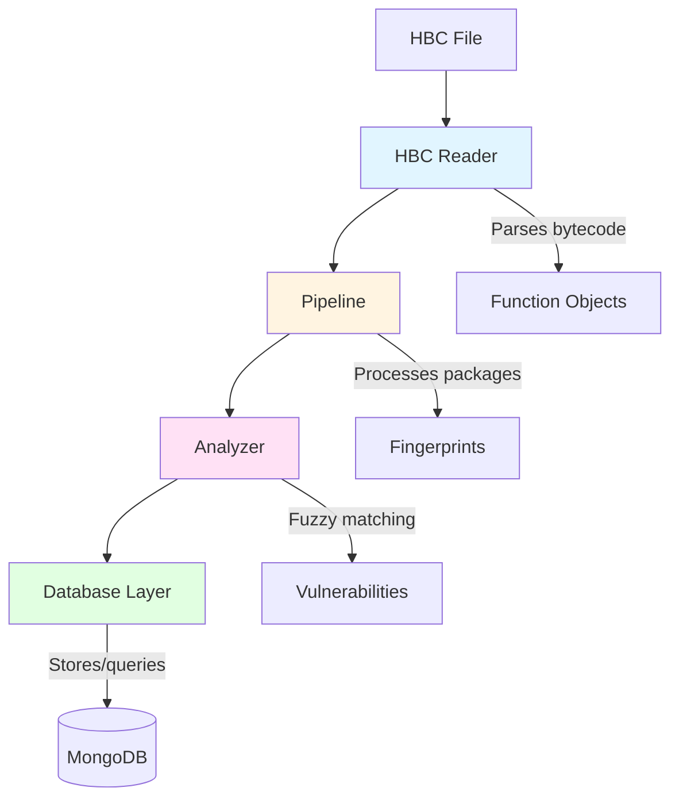
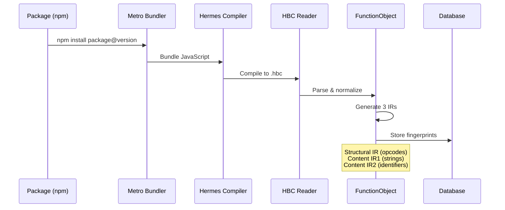
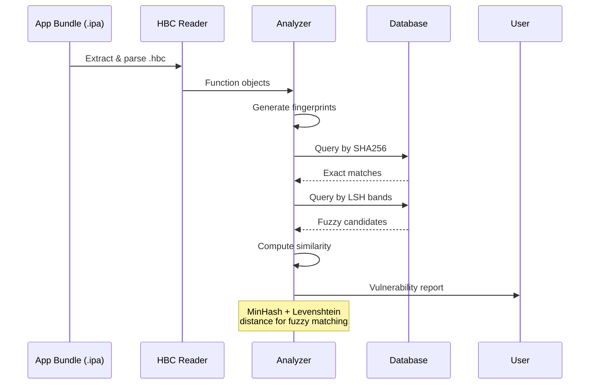

## Architecture Overview

Hedis (Hermes Decompiler/Disassembler) is a Go-based supply chain security tool for analyzing React Native mobile applications. It identifies vulnerable npm packages by fingerprinting Hermes bytecode and matching against a database of known vulnerable package signatures.

## System Components

Hedis consists of four main architectural components that form a complete analysis pipeline:



### 1. HBC Reader (`pkg/hbc/`)

The bytecode parser that reads and disassembles Hermes `.hbc` files into intermediate representations.

**Key responsibilities:**
- Parse HBC file headers and sections
- Support 27 bytecode versions (v61-v96)
- Disassemble instructions with version-specific opcode definitions
- Generate normalized function objects

**Learn more:** [HBC Reader Architecture](/architecture/hbc-reader)

### 2. Pipeline (`pkg/pipeline/`)

The package processing engine that fingerprints npm packages across multiple React Native versions.

**Key responsibilities:**
- Parallel processing across 11 RN environments (0.69-0.79)
- Metro bundling and Hermes compilation orchestration
- Batch database operations for efficiency
- Resume capability via progress tracking

**Learn more:** [Pipeline Architecture](/architecture/pipeline)

### 3. Analyzer (`pkg/analyzer/`)

The fuzzy matching engine that identifies vulnerable packages using MinHash and Levenshtein distance.

**Key responsibilities:**
- Generate multi-level function fingerprints
- Compute MinHash signatures for approximate matching
- LSH (Locality-Sensitive Hashing) for candidate pair retrieval
- Levenshtein distance for final similarity scoring

**Learn more:** [Analyzer Architecture](/architecture/analyzer)

### 4. Database Layer (`pkg/database/`)

MongoDB integration for storing and querying package fingerprints and vulnerability data.

**Collections:**
- `packages` — npm package metadata
- `hashes` / `hashes_ghsa` — function fingerprints per package per RN version
- `baselines_v3` — empty RN app fingerprints for filtering framework functions

## Data Flow

### Fingerprint Generation Pipeline



### Analysis Pipeline



## Multi-Version Strategy

Hedis supports 11 React Native versions (0.69-0.79) in parallel, each with its own Hermes compiler version:

<Accordion title="Why multiple RN versions?">
  Different React Native versions use different Hermes bytecode versions (bcv). A package compiled under RN 0.72 (bcv 84) produces different bytecode than the same package under RN 0.76 (bcv 90). To match packages accurately, Hedis must fingerprint each package under all RN versions that applications might use.

  This creates an `m × n` matrix where:
  - `m` = number of vulnerable npm packages (~300-500)
  - `n` = number of RN versions (11)
  - Total fingerprints ≈ 3,000-5,500 package versions
</Accordion>

## Fingerprint Strategy

Each function is fingerprinted at three levels:

| IR Level | Content | Use Case |
|----------|---------|----------|
| **Structural** | Opcode bigrams (e.g. `LoadParam→GetById`) | Control flow matching, resistant to variable renaming |
| **Content IR1** | Non-identifier string literals | API endpoints, error messages, constants |
| **Content IR2** | Identifiers + object references | Variable names, imports, object shapes |

**Exact matching:** SHA256 hash of each IR

**Fuzzy matching:** MinHash signature (128 dimensions) + LSH (32 bands × 4 rows)

<Accordion title="Why three IRs instead of one?">
  Different obfuscation techniques affect different IR levels:
  - **String encryption** breaks Content IR1 but leaves Structural and Content IR2 intact
  - **Variable renaming** (minification) breaks Content IR2 but leaves Structural and Content IR1
  - **Dead code injection** reduces similarity across all IRs but doesn't eliminate matches
  
  By using three complementary IRs, Hedis can still identify packages even when some obfuscation is present.
</Accordion>

## Parallel Processing Design

The pipeline uses goroutines with semaphore-based concurrency control:

```go
// Process 11 RN versions in parallel (max 4 concurrent)
semaphore := make(chan struct{}, 4)
for _, rnEnv := range rnEnvironments {
    semaphore <- struct{}{} // acquire
    go func(env RNEnvironment) {
        defer func() { <-semaphore }() // release
        ProcessPackagesForRNVersion(env, packages)
    }(rnEnv)
}
```

**Benefits:**
- 4x parallelism for I/O-bound operations (npm install, Metro bundling)
- Prevents resource exhaustion (each RN environment needs ~2GB RAM)
- Database batching (100 ops/batch) reduces network round-trips

## Next Steps

Explore each component in detail:

<CardGroup cols={2}>
  <Card title="HBC Reader" icon="file-binary" href="/architecture/hbc-reader">
    Bytecode parsing and version support
  </Card>
  <Card title="Pipeline" icon="gears" href="/architecture/pipeline">
    Package processing and fingerprinting
  </Card>
  <Card title="Analyzer" icon="magnifying-glass" href="/architecture/analyzer">
    Fuzzy matching algorithms
  </Card>
  <Card title="Database Schema" icon="database" href="/concepts/database-schema">
    MongoDB collections and models
  </Card>
</CardGroup>
