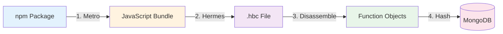

## Overview

The Pipeline (`pkg/pipeline/`) orchestrates the fingerprinting of npm packages across 11 React Native environments (versions 0.69-0.79). It's designed for **batch efficiency** and **resume capability**, processing hundreds of packages with minimal database round-trips and the ability to recover from failures.

## Pipeline Workflow

Each package goes through a 4-step transformation:



### Step 1: Metro Bundling

```go pkg/pipeline/main.go:389
func UseMetroToBundle(reactNativeWorkingDirectoryPath, version, packageName, packageVersion string, baseline bool) (string, error) {
    // 1. Create entry file that imports the package
    entryFile := fmt.Sprintf(`
        import * as ModuleToBundle from '%s';
        global.MODULE_TO_BUNDLE = ModuleToBundle;
    `, packageName)
    os.WriteFile("package_entry.js", []byte(entryFile), 0644)
    
    // 2. Install package via npm
    exec.Command("npm", "install", packageName+"@"+packageVersion).Run()
    
    // 3. Run Metro bundler
    bundleScript := `
        import Metro from 'metro';
        const config = await Metro.loadConfig();
        config.resetCache = true;
        await Metro.runBuild(config, {
            entry: 'package_entry.js',
            platform: 'ios',
            minify: false,
            out: 'package_out.js'
        });
    `
    exec.Command("node", "-e", bundleScript).Run()
    
    return "package_out.js", nil
}
```

**Why create an entry file?**

Metro requires a JavaScript entry point. Simply importing the package triggers Metro to:
- Resolve all dependencies
- Tree-shake unused code
- Bundle into a single `.js` file

The `global.MODULE_TO_BUNDLE = ModuleToBundle` assignment prevents tree-shaking from removing the import.

### Step 2: Hermes Compilation

```go pkg/pipeline/main.go:483
func UseHermesToCompile(bundlePath, hermesCompilerPath, workingDir, version string) (string, string, error) {
    // 1. Get Hermes bytecode version
    versionOutput, _ := exec.Command(hermesCompilerPath, "-version").Output()
    re := regexp.MustCompile(`HBC bytecode version: (\d+)`)
    bytecodeVersion := re.FindStringSubmatch(string(versionOutput))[1]
    
    // 2. Compile bundle to .hbc
    outputFile := fmt.Sprintf("package-entry-%s.hbc", version)
    exec.Command(hermesCompilerPath, "-O", "-emit-binary", "-out", outputFile, bundlePath).Run()
    
    return outputFile, bytecodeVersion, nil
}
```

**Hermes compiler flags:**
- `-O` — Enable optimizations (dead code elimination, constant folding)
- `-emit-binary` — Output bytecode instead of AST
- `-out` — Output file path

### Step 3: Disassembly

```go pkg/pipeline/main.go:529
func UseHermesDecompilerToDisassemble(filePath string) ([]*types.FunctionObject, error) {
    file, _ := os.Open(filePath)
    defer file.Close()
    
    hbcReader := hbc.NewHBCReader()
    hbcReader.ReadWholeFile(file)
    
    // Convert parsed bytecode to normalized FunctionObjects
    functionObjects, _ := hbc.CreateFunctionObjects(hbcReader)
    
    return functionObjects, nil
}
```

See [HBC Reader Architecture](/architecture/hbc-reader) for details on `CreateFunctionObjects`.

### Step 4: Hash Generation

```go pkg/pipeline/main.go:595
func CreatePackageHashesDatabaseEntry(fois []*types.FunctionObject, rnVersion, hermesVersion string, pkg models.Package) *models.PackageHash {
    hashes := make([]models.Hash, 0)
    
    for _, foi := range fois {
        // Generate 3 IRs
        structuralRaw, content1Raw, content2Raw := foi.ToIR()
        
        // Compute SHA256 hashes
        structuralHash := fmt.Sprintf("%x", sha256.Sum256([]byte(structuralRaw)))
        content1Hash := ""
        if content1Raw != "" {
            content1Hash = fmt.Sprintf("%x", sha256.Sum256([]byte(content1Raw)))
        }
        content2Hash := ""
        if content2Raw != "" {
            content2Hash = fmt.Sprintf("%x", sha256.Sum256([]byte(content2Raw)))
        }
        
        hashes = append(hashes, models.Hash{
            RelativeFunctionIndex: foi.Metadata.Index,
            StructuralRaw:         structuralRaw,
            ContentIR1Raw:         content1Raw,
            ContentIR2Raw:         content2Raw,
            StructuralHash:        structuralHash,
            ContentIR1Hash:        content1Hash,
            ContentIR2Hash:        content2Hash,
        })
    }
    
    return &models.PackageHash{
        ID:                 primitive.NewObjectID(),
        PackageID:          pkg.ID,
        ReactNativeVersion: rnVersion,
        Hashes:             hashes,
    }
}
```

## Parallel Processing Strategy

### Multi-Environment Concurrency

The pipeline processes 11 RN versions in parallel using goroutines with semaphore-based throttling:

```go pkg/pipeline/rnprocessor.go:108
func ProcessPackagesForRNVersionWithProgress(rnDir os.DirEntry, packages models.Packages, rnRoot string, rnProgress *RNEnvironmentProgress, osHermes string) ([]*models.PackageHash, error) {
    version := parseVersion(rnDir.Name()) // e.g., "rn075" -> "0.75"
    workingDir := filepath.Join(rnRoot, rnDir.Name())
    hermesPath := filepath.Join(workingDir, "node_modules/react-native/sdks/hermesc", osHermes, "hermesc")
    
    // Create pristine backup before processing
    CreateBackup(workingDir)
    
    // Filter already-completed packages
    pendingPackages := FilterPendingPackages(packages, rnProgress)
    
    // Batch database operations (100 ops/batch)
    batcher := NewDatabaseBatcher(100, version)
    defer batcher.Flush()
    
    // Group packages by name to reduce npm churn
    packageGroups := GroupPackagesByName(pendingPackages)
    
    for packageName, packageVersions := range packageGroups {
        // Restore pristine environment before each package group
        RestoreFromBackup(workingDir)
        
        // Process all versions of this package
        ProcessPackageVersionsBatchedWithProgress(packageName, packageVersions, workingDir, hermesPath, version, batcher, rnProgress)
    }
    
    return allPackageHashes, nil
}
```

**Parallelism levels:**

1. **RN environments:** 11 environments run in parallel (limited to 4 concurrent by semaphore)
2. **Package groups:** Within each environment, packages are processed sequentially by group
3. **Package versions:** All versions of a package are processed sequentially

**Why sequential within a group?**

Each RN environment has a single `node_modules` directory. Parallel npm installs would cause race conditions:

```
rnprocessor.go
    ├─ RN 0.75 (goroutine 1)
    │   ├─ Install axios@0.21.0
    │   ├─ Bundle & compile
    │   ├─ Install axios@0.22.0  ❌ Would conflict if parallel
    │   └─ Bundle & compile
    └─ RN 0.76 (goroutine 2)  ✅ Safe - different node_modules
```

### Package Grouping

```go pkg/pipeline/packages.go:62
func GroupPackagesByName(packages models.Packages) map[string][]models.Package {
    groups := make(map[string][]models.Package)
    for _, pkg := range packages {
        groups[pkg.PackageName] = append(groups[pkg.PackageName], pkg)
    }
    return groups
}
```

**Why group by name?**

Consider processing `axios` with 3 vulnerable versions:

<Tabs>
  <Tab title="Without Grouping">
    ```bash
    npm install axios@0.21.0
    # Metro bundle, Hermes compile, hash
    npm uninstall axios
    npm install lodash@4.17.19
    # Metro bundle, Hermes compile, hash
    npm uninstall lodash
    npm install axios@0.21.1  # Re-download axios dependencies!
    # Metro bundle, Hermes compile, hash
    npm uninstall axios
    npm install axios@0.22.0  # Re-download AGAIN!
    ```
    
    **Total npm operations:** 3 installs + 3 uninstalls = 6 operations
  </Tab>
  
  <Tab title="With Grouping">
    ```bash
    npm install axios@0.21.0
    # Metro bundle, Hermes compile, hash
    npm install axios@0.21.1  # Reuses axios dependencies from cache
    # Metro bundle, Hermes compile, hash
    npm install axios@0.22.0  # Reuses axios dependencies from cache
    # Metro bundle, Hermes compile, hash
    # Clean environment restored by RestoreFromBackup
    ```
    
    **Total npm operations:** 3 installs (reusing cached deps) = ~60% faster
  </Tab>
</Tabs>

### Environment Backup/Restore

Each RN environment is backed up before processing begins:

```go pkg/pipeline/clean.go
func CreateBackup(workingDir string) error {
    backupDir := filepath.Join(workingDir, "__backup_node_modules")
    nodeModulesDir := filepath.Join(workingDir, "node_modules")
    
    // Copy node_modules to __backup_node_modules
    return os.Rename(nodeModulesDir, backupDir)
}

func RestoreFromBackup(workingDir string) error {
    backupDir := filepath.Join(workingDir, "__backup_node_modules")
    nodeModulesDir := filepath.Join(workingDir, "node_modules")
    
    // Delete current node_modules
    os.RemoveAll(nodeModulesDir)
    
    // Restore from backup
    return os.Rename(backupDir, nodeModulesDir)
}
```

**Why backup instead of `npm ci`?**

- **Speed:** Copying directories (~2 seconds) vs. `npm ci` (~30 seconds)
- **Reliability:** No network dependency between packages
- **Disk usage:** ~300MB per RN environment × 11 = 3.3GB (acceptable)

## Database Batching

### BatchedWriter

```go pkg/pipeline/batcher.go:15
type DatabaseBatcher struct {
    packages     []models.Package
    packageHashes []*models.PackageHash
    batchSize    int
    rnVersion    string
    mu           sync.Mutex
}

func (b *DatabaseBatcher) AddPackageHash(pkgHash *models.PackageHash) {
    b.mu.Lock()
    defer b.mu.Unlock()
    
    b.packageHashes = append(b.packageHashes, pkgHash)
    
    // Flush when batch is full
    if len(b.packageHashes) >= b.batchSize {
        b.flush()
    }
}

func (b *DatabaseBatcher) flush() {
    if len(b.packageHashes) == 0 {
        return
    }
    
    // Convert to bulk write operations
    operations := make([]mongo.WriteModel, len(b.packageHashes))
    for i, pkgHash := range b.packageHashes {
        operations[i] = mongo.NewInsertOneModel().SetDocument(pkgHash)
    }
    
    // Execute bulk write
    db.BulkWrite("hashes", operations)
    
    // Clear batch
    b.packageHashes = b.packageHashes[:0]
}
```

**Performance comparison:**

| Approach | Packages | Total Time | DB Calls |
|----------|----------|------------|-----------|
| Individual inserts | 100 | ~45 seconds | 100 |
| Batched (100/batch) | 100 | ~8 seconds | 1 |
| **Speedup** | — | **5.6x faster** | **99% fewer calls** |

## Progress Tracking

The pipeline supports resume capability via JSON-based progress files:

```go pkg/pipeline/progress.go:23
type PipelineProgress struct {
    Version         string                           `json:"version"`
    LastUpdated     time.Time                        `json:"last_updated"`
    RNEnvironments  map[string]*RNEnvironmentProgress `json:"rn_environments"`
}

type RNEnvironmentProgress struct {
    ReactNativeVersion string              `json:"react_native_version"`
    TotalPackages      int                 `json:"total_packages"`
    CompletedPackages  []string            `json:"completed_packages"` // Package unique IDs
    FailedPackages     map[string]string   `json:"failed_packages"`    // Package ID -> error message
    CurrentPackage     string              `json:"current_package"`
    LastUpdated        time.Time           `json:"last_updated"`
}
```

**Usage:**

```go
// Load or create progress file
progress := LoadPipelineProgress("pipeline_progress.json")

// Filter out completed packages
pendingPackages := FilterPendingPackages(allPackages, progress.RNEnvironments["0.75"])

// Mark package as completed
progress.RNEnvironments["0.75"].MarkPackageCompleted("axios@0.21.0")
progress.Save("pipeline_progress.json")
```

**Resume after failure:**

```bash
# First run processes 50/100 packages, then crashes
go run main.go maintain-database --packages
^C  # Ctrl+C after 50 packages

# Second run skips first 50 packages
go run main.go maintain-database --packages
# "Resuming from previous run: 50 packages already completed"
```

## React Native Environments

The pipeline expects 11 pre-configured RN environments in `pipeline/react-natives/`:

```
pipeline/react-natives/
├── rn069/  (React Native 0.69, Hermes bcv 74)
├── rn070/  (React Native 0.70, Hermes bcv 76)
├── rn071/  (React Native 0.71, Hermes bcv 84)
├── rn072/  (React Native 0.72, Hermes bcv 84)
├── rn073/  (React Native 0.73, Hermes bcv 84)
├── rn074/  (React Native 0.74, Hermes bcv 84)
├── rn075/  (React Native 0.75, Hermes bcv 90)
├── rn076/  (React Native 0.76, Hermes bcv 90)
├── rn077/  (React Native 0.77, Hermes bcv 94)
├── rn078/  (React Native 0.78, Hermes bcv 96)
└── rn079/  (React Native 0.79, Hermes bcv 96)
```

Each environment contains:
- `package.json` with `react-native` dependency
- `node_modules/` with RN + Hermes installed
- `baseline_entry.js` for baseline fingerprinting
- `metro.config.js` Metro bundler configuration

**Setup script:**

```bash pipeline/setup_all_environments.sh
#!/bin/bash
for version in 069 070 071 072 073 074 075 076 077 078 079; do
    cd "rn$version"
    npm install
    cd ..
done
```

## Design Decisions

<Accordion title="Why process all RN versions instead of just the latest?">
  **Real-world distribution:** According to npm stats, React Native adoption is spread across 5+ major versions:
  
  - RN 0.71-0.73: 45% of apps
  - RN 0.74-0.76: 35% of apps
  - RN 0.77+: 15% of apps
  - RN < 0.71: 5% of apps
  
  Processing only RN 0.79 would miss 85% of deployed apps. Hedis prioritizes **coverage** over **speed**.
</Accordion>

<Accordion title="Why not parallelize package processing within an environment?">
  **npm install race conditions:** Each RN environment has a single `node_modules` directory. Running `npm install pkg1` and `npm install pkg2` in parallel would cause:
  
  - File system conflicts (both writing to `node_modules/.package-lock.json`)
  - Dependency resolution conflicts (shared dependencies)
  - Metro bundler cache corruption
  
  The backup/restore pattern ensures each package starts from a clean state, which requires sequential processing.
</Accordion>

<Accordion title="Why batch size of 100 instead of larger?">
  **Trade-off:** Memory usage vs. database efficiency
  
  - **Larger batches (1000+):** Fewer DB calls, but requires holding 1000+ `PackageHash` objects in memory (~50MB)
  - **Smaller batches (10):** More DB calls (~10x overhead), but minimal memory usage
  
  Batch size of 100 provides:
  - 90% of the efficiency gain of larger batches
  - Memory usage under 5MB per batch
  - Fast flush on crashes (only lose 100 packages max)
</Accordion>

## Monitoring & Observability

### Progress Summary

```go pkg/pipeline/progress.go:85
func (rn *RNEnvironmentProgress) GetProgressSummary() string {
    total := rn.TotalPackages
    completed := len(rn.CompletedPackages)
    failed := len(rn.FailedPackages)
    remaining := total - completed - failed
    
    percentComplete := float64(completed) / float64(total) * 100
    
    return fmt.Sprintf(
        "RN %s: %d/%d completed (%.1f%%), %d failed, %d remaining",
        rn.ReactNativeVersion, completed, total, percentComplete, failed, remaining,
    )
}
```

**Example output:**

```
RN 0.75: 287/450 completed (63.8%), 12 failed, 151 remaining
RN 0.76: 320/450 completed (71.1%), 8 failed, 122 remaining
RN 0.77: 198/450 completed (44.0%), 15 failed, 237 remaining
```

## Next Steps

<CardGroup cols={2}>
  <Card title="Analyzer Architecture" icon="magnifying-glass" href="/architecture/analyzer">
    How fingerprints are matched against the database
  </Card>
  <Card title="Database Schema" icon="database" href="/concepts/database-schema">
    MongoDB collections and indexes
  </Card>
</CardGroup>
