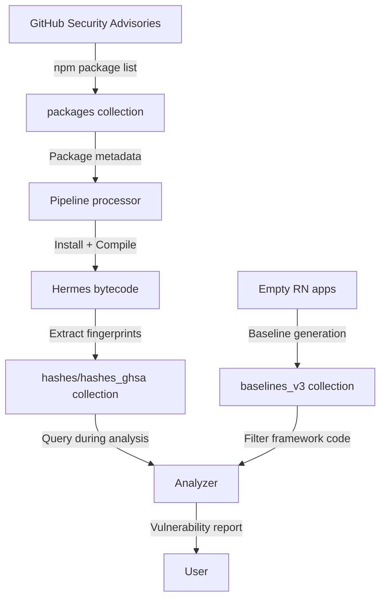

## Overview

Hedis uses **MongoDB** to store fingerprints for vulnerable packages and React Native baselines. The database name is configurable via `MONGO_DB_NAME` (default: `hedis`).

## Core Collections

Hedis maintains four primary collections:

1. **`packages`** — npm package metadata and vulnerability information
2. **`hashes` / `hashes_ghsa`** — Function fingerprints for each package per React Native version
3. **`baselines_v3`** — Baseline fingerprints for empty React Native apps

## Collection: `packages`

Stores npm package information and tracks processing status.

### Schema

```go
type PackageWithVulnerabilitiesModel struct {
    ID             primitive.ObjectID `bson:"_id"`
    PackageName    string             `bson:"package_name"`
    PackageVersion string             `bson:"package_version"`
    AdvisoryUrls   []string           `bson:"advisory_urls"`
    HasError       bool               `bson:"has_error"`
    Error          map[string]string  `bson:"error"`  // Key: RN version, Value: error message
}
```

### Purpose

- **Package tracking** — Maintains list of packages to fingerprint from GitHub Security Advisories
- **Error handling** — Tracks which React Native versions failed during processing
- **Resume capability** — Pipeline can skip packages with known errors

### Example Document

```json
{
  "_id": ObjectId("..."),
  "package_name": "react-native-document-picker",
  "package_version": "8.0.0",
  "advisory_urls": [
    "https://github.com/advisories/GHSA-xxxx-yyyy-zzzz"
  ],
  "has_error": true,
  "error": {
    "0.69.0": "Failed to install dependencies",
    "0.70.0": "Hermes compilation error"
  }
}
```

<Info>
The `Error` map uses React Native version strings as keys, allowing fine-grained error tracking across different environments.
</Info>

## Collection: `hashes` / `hashes_ghsa`

Stores function-level fingerprints for each package compiled under each React Native version.

### Schema

```go
type PackageHashModel struct {
    ID                 primitive.ObjectID `bson:"_id"`
    PackageID          primitive.ObjectID `bson:"package_id"`      // Reference to packages collection
    ReactNativeVersion string             `bson:"react_native_version"` // e.g. "0.72.0"
    Hash               Hash               `bson:"hash"`
}

type Hash struct {
    RelativeFunctionIndex int    `bson:"relative_function_index"`
    
    // Raw IR strings
    StructuralRaw         string `bson:"structural_raw"`
    ContentIR1Raw         string `bson:"content_ir1_raw,omitempty"`
    ContentIR2Raw         string `bson:"content_ir2_raw,omitempty"`
    
    // SHA256 hex digests
    StructuralHash        string `bson:"structural_hash"`
    ContentIR1Hash        string `bson:"content_ir1_hash,omitempty"`
    ContentIR2Hash        string `bson:"content_ir2_hash,omitempty"`
}
```

### Purpose

- **Exact matching** — SHA256 hashes indexed for fast lookups
- **Fuzzy matching** — Raw IR strings stored for Levenshtein distance comparison
- **Version specificity** — Each package × RN version combination generates unique fingerprints

### Example Document

```json
{
  "_id": ObjectId("..."),
  "package_id": ObjectId("..."),
  "react_native_version": "0.72.0",
  "hash": {
    "relative_function_index": 42,
    "structural_raw": "pc=2|LoadParam|LoadParam|GetById|JStrictNotEqual|JmpTrue|LoadConstString|Ret|",
    "structural_hash": "a3b2c1d4e5f6...",
    "content_ir1_raw": "document_picker_canceled|invalid file type|pick a file",
    "content_ir1_hash": "f6e5d4c3b2a1...",
    "content_ir2_raw": "opts|type|nativemodules|rndocumentpicker|pick",
    "content_ir2_hash": "1a2b3c4d5e6f..."
  }
}
```

<Note>
The `omitempty` BSON tag on Content IR1/IR2 fields means they will be absent from the document if the function has no string literals (IR1) or identifiers/objects (IR2).
</Note>

### Indexes

For performance, these fields are indexed:

```javascript
// Exact match lookups
db.hashes_ghsa.createIndex({ "hash.structural_hash": 1 })
db.hashes_ghsa.createIndex({ "hash.content_ir1_hash": 1 })
db.hashes_ghsa.createIndex({ "hash.content_ir2_hash": 1 })

// Package filtering
db.hashes_ghsa.createIndex({ "package_id": 1 })
db.hashes_ghsa.createIndex({ "react_native_version": 1 })

// Fuzzy matching length filters
db.hashes_ghsa.createIndex({ "hash.structural_raw": "text" })
db.hashes_ghsa.createIndex({ "hash.content_ir1_raw": "text" })
db.hashes_ghsa.createIndex({ "hash.content_ir2_raw": "text" })
```

## Collection: `baselines_v3`

Stores fingerprints for **empty React Native apps** (no third-party packages) to filter out framework functions.

### Schema

```go
type BaselineModel struct {
    ID                    primitive.ObjectID `bson:"_id"`
    ReactNativeVersion    string             `bson:"react_native_version"`
    HermesBytecodeVersion string             `bson:"hermes_bytecode_version"`
    Hashes                []Hash             `bson:"hashes"`
}
```

### Purpose

- **False positive reduction** — Excludes React Native framework code from matches
- **Version-specific baselines** — Each RN version has a unique baseline
- **Bytecode tracking** — Links baseline to specific Hermes compiler version

### Example Document

```json
{
  "_id": ObjectId("..."),
  "react_native_version": "0.72.0",
  "hermes_bytecode_version": "94",
  "hashes": [
    {
      "relative_function_index": 0,
      "structural_raw": "pc=0|CreateEnvironment|LoadConstUndefined|Ret|",
      "structural_hash": "e8f9a0b1c2d3...",
      "content_ir1_raw": "",
      "content_ir1_hash": "",
      "content_ir2_raw": "global|undefined",
      "content_ir2_hash": "d3c2b1a0f9e8..."
    },
    // ... more baseline functions
  ]
}
```

### Generation

Baselines are generated using:

```bash
hedis maintain-database --baseline
```

This command:
1. Creates an empty React Native app for each supported version (0.69-0.79)
2. Bundles with Metro and compiles with Hermes
3. Extracts all function fingerprints
4. Stores in `baselines_v3` collection

<Tip>
Regenerate baselines when:
- Adding support for a new React Native version
- Upgrading to a new Hermes compiler version
- Framework code patterns change significantly
</Tip>

## Data Flow



## Query Patterns

### Exact Hash Lookup

```javascript
// Find packages with matching structural hash
db.hashes_ghsa.find({
  "hash.structural_hash": "a3b2c1d4e5f6..."
})
```

### Fuzzy Match Pre-Filter (Length-Based)

```javascript
// Find hashes with compatible IR string lengths (±20%)
const targetLength = 100;
const tolerance = 0.2;

db.hashes_ghsa.find({
  "hash.structural_raw": { 
    $exists: true, 
    $ne: "",
    $type: "string"
  }
  // Length filtering done in application code
})
```

### Package-Specific Lookup

```javascript
// Find all fingerprints for a package across RN versions
db.hashes_ghsa.find({
  "package_id": ObjectId("...")
})
```

### Baseline Filtering

```javascript
// Get baseline hashes for RN version 0.72.0
db.baselines_v3.findOne({
  "react_native_version": "0.72.0"
})
```

## Database Maintenance

The `maintain-database` command manages database operations:

```bash
# Update package list from GitHub Security Advisories
hedis maintain-database --update-security-advisories

# Download advisories and populate packages collection
hedis maintain-database --download-github-advisories-and-packages

# Process packages to generate fingerprints
hedis maintain-database --packages

# Generate baselines for all RN versions
hedis maintain-database --baseline
```

## Storage Considerations

**Typical collection sizes:**

- `packages`: ~10,000 documents (one per vulnerable package version)
- `hashes_ghsa`: ~5,000,000 documents (functions × packages × RN versions)
- `baselines_v3`: ~11 documents (one per RN version, each with ~500-2000 function hashes)

**Disk space:**

- Raw IR strings: ~200-500 bytes per function
- SHA256 hashes: 64 bytes per hash type
- Total: ~500 MB - 2 GB for typical fingerprint database

<Note>
Consider using MongoDB compression and proper indexing to optimize storage and query performance. The `hashes_ghsa` collection benefits significantly from compound indexes on `(react_native_version, hash.structural_hash)`.
</Note>

## Related Sections

- [Fingerprinting](/concepts/fingerprinting) — How hashes are generated
- [Fuzzy Matching](/concepts/fuzzy-matching) — How raw IR strings are compared
- [Hermes Bytecode](/concepts/hermes-bytecode) — Source of the fingerprint data
